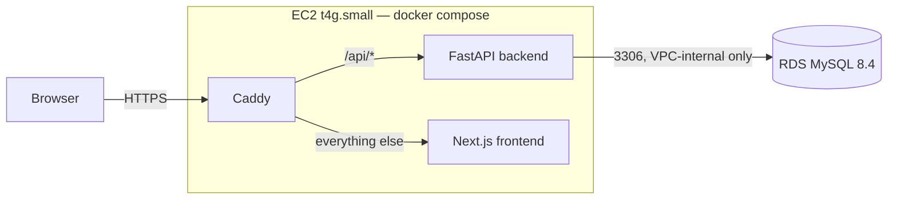

# Gradient

An adaptive maths practice app. Students answer multiple-choice questions
on logarithms, trigonometry and derivatives; after every answer a per-topic
ability estimate updates, and the next question is chosen to match it.
Wrong answers explain the specific mistake before showing the worked
solution.

**Live demo:** https://gradient-quiz.duckdns.org — type any name to start;
there is no account.

The adaptive engine is a one-parameter logistic IRT model (Rasch), the
same family of model that real adaptive testing platforms use, run online
so it works from the first answer with no training corpus. Question
difficulty is estimated from real outcomes, not a static easy/medium/hard
label.

---

## Architecture



| Layer | Choice | Where to read more |
| --- | --- | --- |
| Frontend | Next.js 16, TypeScript, Tailwind v4 | [docs/design.md](docs/design.md) |
| Backend | FastAPI, SQLAlchemy async, Alembic | [docs/api.md](docs/api.md) |
| Database | MySQL 8.4 | [docs/data-model.md](docs/data-model.md) |
| Adaptive engine | Rasch model, online SGD updates | [docs/irt-model.md](docs/irt-model.md) |
| Deployment | Docker, EC2, RDS, Caddy for TLS | [docs/deploy.md](docs/deploy.md) |

The backend is stateless. A session is a fixed run of questions that the
frontend assembles by passing back what it has already asked, so nothing
repeats within a sitting and there is no server-side session to store.

---

## How the adaptive part works

Each student has an ability **θ** per topic and each question has a
difficulty **b**, both on the same logit scale. The chance of a correct
answer is

```
p = 1 / (1 + exp(-(θ - b)))
```

so a question one logit above a student's ability is answered correctly
about 27% of the time, and one at their level exactly half the time.

After each answer both parameters take a small gradient step on the same
error term:

```
error = outcome - p
θ ← θ + 0.3 · error
b ← b - (0.3 / (1 + n/10)) · error      # n = answers this question has had
```

The asymmetry is the design: **ability moves, difficulty settles.** The
student's rate stays constant because a learner's ability is not
stationary, and freezing it would mean never noticing improvement. The
question's rate decays because a question does not get harder, so its
estimate should converge.

Selection ranks unseen questions by `|b − θ|` and picks at random from the
five nearest, so the served question is near-maximally informative
without every student seeing the same one. Once a topic has no unseen
questions, selection turns to the ones last answered wrong, weighted by
how recent the mistake was. A topic is complete when every question has
been answered correctly at least once.

The full reasoning, including the two things the tests revealed about the
update rule, is in [docs/irt-model.md](docs/irt-model.md).

---

## Running it locally

Prerequisites: Docker, Python 3.12, Node 20 or newer.

**1. Credentials.** Copy the example and fill in any values you like for
the local database:

```bash
cp .env.example .env
```

**2. MySQL.** Starts a local MySQL 8.4 in Docker on port 3306:

```bash
docker compose up -d
```

**3. Backend.** Creates the schema, loads the 54 questions, and serves the
API on port 8000. The interactive API docs are at `/docs`.

```bash
cd backend
python -m venv venv && source venv/bin/activate
pip install -r requirements-dev.txt
alembic upgrade head
python scripts/seed.py
uvicorn app.main:app --reload --port 8000
```

**4. Frontend.** In a second terminal. Opens on http://localhost:3000 and
talks to the backend above by default.

```bash
cd frontend
npm install
npm run dev
```

**Tests.** The backend suite runs against the real MySQL from step 2,
because the schema leans on CHECK constraints, generated columns and
composite foreign keys that only MySQL enforces. Every test rolls back its
own writes.

```bash
cd backend && pytest
```

**The whole stack in Docker**, as it runs on the server: backend and
frontend images are built and started alongside MySQL.

```bash
docker compose --profile app up --build -d
```

---

## Why these decisions

**IRT rather than a static difficulty label.** A label written by the
author is a guess. Two questions both marked "medium" can differ a great
deal in practice, and the only way to know is to watch real answers. Here
every question starts from its label's prior and then moves toward what
students actually do with it, so the bank calibrates itself over time.

**IRT rather than Elo.** Elo rates two competitors of the same kind
against each other. A student and a question are not the same kind of
thing, and the difference matters: a question's difficulty should
converge while a student's ability should keep tracking. Expressing that
in Elo means a separate K-factor schedule per side, which is IRT rebuilt
under another name. IRT also carries the vocabulary the assessment
industry uses, so the model transfers directly.

**Rasch, not 2PL or 3PL.** Adding a discrimination parameter or a guessing
parameter would need a response matrix to calibrate against, and this
system has to work from the very first answer. The costs are stated
rather than hidden: every question is assumed to discriminate equally,
and guessing is controlled only by having four options rather than three.

**Online point estimates, not joint maximum likelihood.** Real calibration
fits all students and items together over a full dataset. Updating one
pair per answer is the simplification that makes an empty bank usable on
day one. Both parameters before and after each answer are stored on the
attempt, so every update can be replayed and audited.

**Ability is shown as accuracy, not θ.** The interface shows the share of
questions answered correctly and a band. θ describes how the app picks
questions, not how well someone is doing, and a rising line of it was
found to be something a student could not act on. θ still drives
selection and is still stored; it simply never reaches the screen.

**MySQL.** The data is relational: attempts reference questions and
users, options belong to questions, and a wrong answer must reference an
option of the question it answers. That last rule is a composite foreign
key, and the schema also uses CHECK constraints and a generated column
that lets a unique index enforce exactly one correct option per
question. MySQL 8.0.16 or later enforces all three, RDS runs
it as a managed service, and it is common in the industry this project is
aimed at. PostgreSQL would have served equally well; nothing here depends
on a MySQL-only feature.

**No cache.** Every request is a handful of indexed queries over a bank of
54 questions, and the backend holds no session state to share. A cache
would add a container and a consistency problem to a system with nothing
slow in it. The thresholds at which that changes are below.

**No authentication.** A display name is all a student gives. The project
demonstrates adaptive difficulty; accounts, passwords and email would add
a great deal of surface area and nothing to that demonstration.

**One origin in production.** Caddy serves the frontend at the root and
proxies `/api/*` to the backend, so the browser never makes a cross-origin
request and Caddy manages the TLS certificate on its own. The frontend's
API base URL is fixed at build time, which is why the frontend image is
built per environment rather than promoted between them.

**Deployed by hand, recorded in full.** Each AWS resource was created from
the CLI and the exact commands and the reasons behind each option live in
[docs/deploy.md](docs/deploy.md). That record is a deliberate deliverable:
it is what a teammate would need to rebuild the environment, and it is
honest about what went wrong the first time.

---

## How this would scale

The design is small on purpose, and each part has a known point at which
it would need to change.

| Pressure | Roughly where it bites | What changes first |
| --- | --- | --- |
| Questions per topic | ~10,000 | Selection loads a topic's unseen questions and tags into Python per request. The fix is ranking in SQL, not a cache. |
| Attempts per student | ~10,000 | Progress reads a student's whole history to build the series. The fix is a stored summary or pagination. |
| Concurrent students | several hundred | Each answer is about eight queries. Connection pooling and a read replica come before any cache. |
| Backend instances | more than one | Topic-level tag structure, shared by every student, becomes worth caching. On one instance that is an in-process dictionary; a shared cache such as Valkey earns its place only when several instances need the same view. |

Two other things would change before any of those:

- **Model calibration.** With a real response matrix, item parameters
  could be re-fit offline by joint maximum likelihood and the online
  update kept only for new items and for ability. That is a batch job
  reading the attempts table, which already stores everything it needs.
- **The image pipeline.** Images are built on the instance. The next step
  is building once, pushing to a registry, and having instances pull, so
  a deploy is a pull rather than a compile.

---

## Repository

```
backend/     FastAPI app, Alembic migrations, seed script, tests
frontend/    Next.js app; the design tokens live in app/globals.css
docs/        the design records: data model, IRT model, API, design, deploy
scripts/     server setup and deploy, migration round-trip check
```

Every non-obvious decision has a home in `docs/`, written at the time the
decision was made. The build plan and its history are in
[CLAUDE.md](CLAUDE.md).
